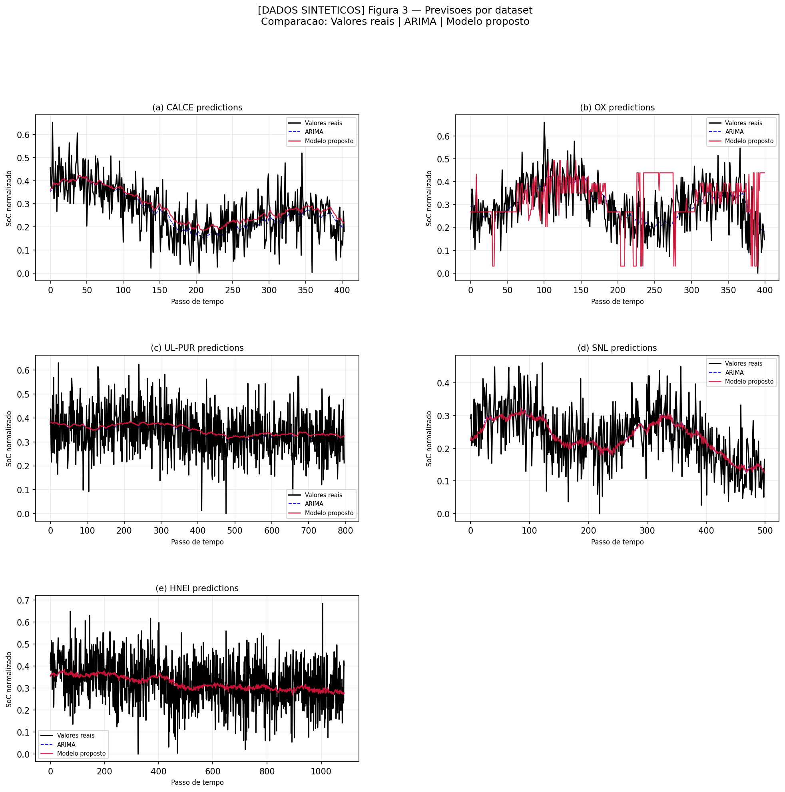
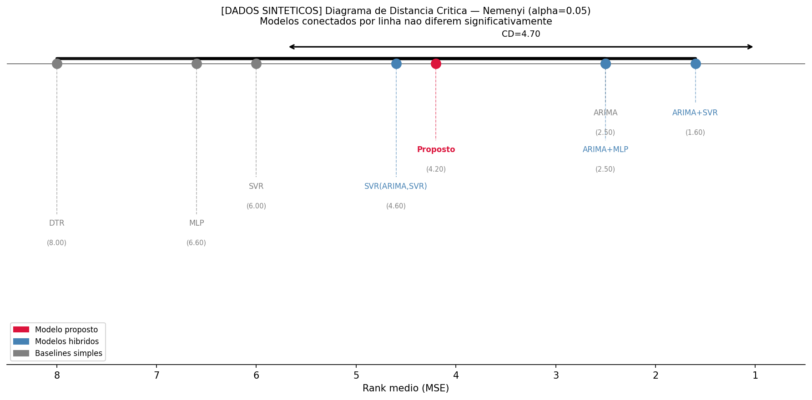

# Sistema Híbrido Seletivo para Previsão de SoC em Baterias de Lítio-íon
# Selective Hybrid System for SoC Forecasting in Lithium-ion Batteries

> Reprodução do experimento proposto por Cruz Medina e de Oliveira (2021)  
> Reproduction of the experiment proposed by Cruz Medina and de Oliveira (2021)

---

## 📋 Sobre o Projeto / About the Project

**PT:** Este repositório contém a reprodução completa do experimento descrito no artigo *"A selective hybrid system for State-of-Charge forecasting of Lithium-ion batteries"* (Cruz Medina & de Oliveira, 2021). O modelo proposto combina um modelo linear ARIMA com um preditor não-linear selecionado adaptativamente de um pool (MLP, DTR, SVR), além de uma função de combinação também selecionada de forma adaptativa. Os experimentos foram conduzidos com dados sintéticos coerentes com as propriedades estatísticas das séries de SoC reais.

**EN:** This repository contains the full reproduction of the experiment described in the paper *"A selective hybrid system for State-of-Charge forecasting of Lithium-ion batteries"* (Cruz Medina & de Oliveira, 2021). The proposed model combines a linear ARIMA model with an adaptively selected non-linear predictor from a pool (MLP, DTR, SVR), along with an adaptively selected combination function. Experiments were conducted using synthetic data consistent with the statistical properties of real SoC time series.

---

## 🏗️ Arquitetura do Modelo / Model Architecture

```
Série Temporal (Zt)
        │
        ▼
   ┌─────────┐
   │  ARIMA  │ ──── Previsão Linear (L̂t)
   └─────────┘
        │
        ▼ Resíduo (Et = Zt - L̂t)
        │
   ┌────────────────────────┐
   │  Pool Não-Linear       │
   │  MLP | DTR | SVR       │ ──── Seleção via validação (1º nível)
   └────────────────────────┘
        │
        ▼ Previsão do Resíduo (N̂t)
        │
   ┌────────────────────────┐
   │  Pool de Combinação    │
   │  Soma | SVR | DTR | MLP│ ──── Seleção via validação (2º nível)
   └────────────────────────┘
        │
        ▼
   Previsão Final (Ẑt)
```

---

## 📁 Estrutura do Repositório / Repository Structure

```
SoC_Experiment/
│
├── data/                          # Datasets sintéticos / Synthetic datasets
│   ├── CALCE_synthetic_soc.csv
│   ├── OX_synthetic_soc.csv
│   ├── UL_PUR_synthetic_soc.csv
│   ├── SNL_synthetic_soc.csv
│   └── HNEI_synthetic_soc.csv
│
├── results/                       # Gráficos e tabelas gerados / Generated plots and tables
│   ├── EDA_*.png                  # Análise exploratória / Exploratory analysis
│   ├── FIGURA3_*.png              # Previsões finais / Final predictions
│   ├── FIGURA4_nemenyi_*.png      # Diagrama de Nemenyi / Nemenyi diagram
│   ├── FINAL_tabela_*.csv         # Tabelas de resultados / Results tables
│   └── ...
│
├── 00_setup.py                    # Verificação do ambiente / Environment check
├── 01_load_and_preprocess.py      # Carregamento e pré-processamento / Loading and preprocessing
├── 01b_exploratory_analysis.py    # Análise exploratória (EDA) / Exploratory data analysis
├── 02_arima_stage.py              # Estágio linear — ARIMA / Linear stage — ARIMA
├── 03_nonlinear_stage.py          # Estágio não-linear + seleção NM / Non-linear stage + NM selection
├── 04_combination_stage.py        # Estágio de combinação + seleção CM / Combination stage + CM selection
├── 05_baselines.py                # Modelos baseline para comparação / Baseline models for comparison
├── 06_figure3_predictions.py      # Visualização das previsões / Predictions visualization
├── 07_nemenyi_test.py             # Teste estatístico de Nemenyi / Nemenyi statistical test
│
├── .gitignore
├── LICENSE
└── README.md
```

---

## 🗃️ Bases de Dados / Datasets

**PT:** Os dados originais estão disponíveis no repositório [BatteryArchive.org](https://www.batteryarchive.org). Nesta reprodução foram utilizados dados **sintéticos** que preservam as propriedades estatísticas das séries reais.

**EN:** The original data is available at [BatteryArchive.org](https://www.batteryarchive.org). This reproduction uses **synthetic** data that preserves the statistical properties of the real series.

| Dataset | Ciclos / Cycles | Cátodo / Cathode | C [Ah] | T [°C] |
|---------|----------------|-----------------|--------|--------|
| CALCE   | 2016           | LCO             | 1.35   | 25     |
| OX      | 8200           | LCO             | 0.74   | 40     |
| UL-PUR  | 301            | NCA             | 3.40   | 23     |
| SNL     | 3038           | LFP             | 1.10   | 25     |
| HNEI    | 1113           | NMC-LCO         | 2.80   | 25     |

---

## ⚙️ Requisitos / Requirements

- Python 3.10+
- pip

### Bibliotecas / Libraries

```bash
pip install pandas numpy matplotlib scikit-learn statsmodels pmdarima scikit-posthocs
```

---

## 🚀 Como Executar / How to Run

**PT:** Execute os scripts na ordem indicada pelos prefixos numéricos. Cada script é autossuficiente e não depende de importações entre arquivos.

**EN:** Run the scripts in the order indicated by their numeric prefixes. Each script is self-contained and does not depend on imports from other files.

### Passo a Passo / Step by Step

**1. Clone o repositório / Clone the repository**
```bash
git clone https://github.com/PolianaQueiroz/SoC_Experiment.git
cd SoC_Experiment
```

**2. Instale as dependências / Install dependencies**
```bash
pip install pandas numpy matplotlib scikit-learn statsmodels pmdarima scikit-posthocs
```

**3. Pré-processamento / Preprocessing**
```bash
python 01_load_and_preprocess.py
```

**4. Análise exploratória / Exploratory analysis**
```bash
python 01b_exploratory_analysis.py
```

**5. Estágio linear — ARIMA / Linear stage — ARIMA**
```bash
python 02_arima_stage.py
```
> ⏱️ ~5 min

**6. Estágio não-linear / Non-linear stage**
```bash
python 03_nonlinear_stage.py
```
> ⏱️ ~60 min (grid search em 3 modelos × 5 datasets)

**7. Estágio de combinação / Combination stage**
```bash
python 04_combination_stage.py
```
> ⏱️ ~50 min

**8. Modelos baseline / Baseline models**
```bash
python 05_baselines.py
```
> ⏱️ ~50 min (7 modelos × 5 datasets)

**9. Visualização das previsões / Predictions visualization**
```bash
python 06_figure3_predictions.py
```
> ⏱️ ~25 min

**10. Teste de Nemenyi / Nemenyi test**
```bash
python 07_nemenyi_test.py
```
> ⏱️ < 1 min

Todos os gráficos e tabelas serão salvos automaticamente na pasta `results/`.  
All plots and tables will be automatically saved in the `results/` folder.

---

## 📊 Principais Resultados / Main Results

### Modelos Selecionados por Dataset / Selected Models per Dataset

| Dataset | NM Selecionado / Selected NM | CM Selecionado / Selected CM |
|---------|------------------------------|------------------------------|
| CALCE   | DTR                          | SVR                          |
| OX      | MLP                          | DTR                          |
| UL-PUR  | SVR                          | SVR                          |
| SNL     | SVR                          | Summation                    |
| HNEI    | MLP                          | Summation                    |

### Ranks Médios — Teste de Nemenyi / Average Ranks — Nemenyi Test

| Modelo / Model  | Rank MSE | Rank MAE |
|----------------|----------|----------|
| ARIMA+SVR       | 1.60     | 2.30     |
| ARIMA           | 2.50     | 2.40     |
| ARIMA+MLP       | 2.50     | 2.50     |
| **Proposto / Proposed** | **4.20** | **4.00** |
| SVR(ARIMA,SVR)  | 4.60     | 4.20     |
| SVR             | 6.00     | 6.00     |
| MLP             | 6.60     | 6.60     |
| DTR             | 8.00     | 8.00     |

> **Nota / Note:** Resultados obtidos com dados sintéticos. Com dados reais (BatteryArchive.org), o artigo original reporta o modelo proposto em 1º lugar (rank 1.2).  
> Results obtained with synthetic data. With real data (BatteryArchive.org), the original paper reports the proposed model in 1st place (rank 1.2).

---

## 📈 Visualizações / Visualizations

### Figura 3 — Previsões por Dataset / Predictions per Dataset


### Figura 4 — Diagrama de Nemenyi (MSE) / Nemenyi Diagram (MSE)


---

## 📖 Referência / Reference

```bibtex
@article{cruzmedina2021,
  title   = {A selective hybrid system for State-of-Charge forecasting
             of Lithium-ion batteries},
  author  = {Cruz Medina, Marie Chantelle and de Oliveira, Jo{\~a}o Fausto L.},
  journal = {Springer Nature},
  year    = {2021}
}
```

---

## 👩‍💻 Autora / Author

**Poliana Santos de Queiroz**  
Escola Politécnica de Pernambuco — Universidade de Pernambuco  
poliana.santos.queiroz@gmail.com

---

## 📄 Licença / License

Este projeto está licenciado sob os termos do arquivo [LICENSE](LICENSE).  
This project is licensed under the terms of the [LICENSE](LICENSE) file.
